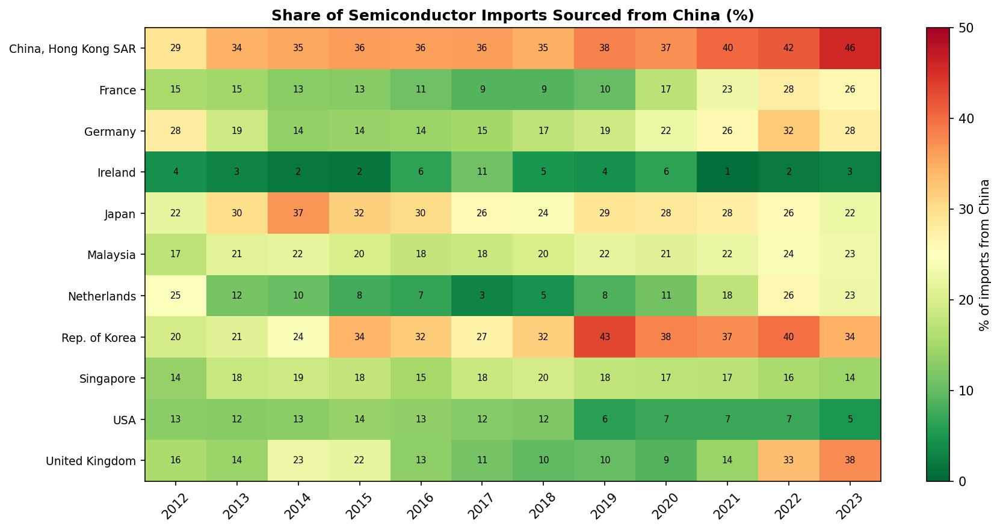

# Global Semiconductor Supply Chain Vulnerability

Network analysis of the global semiconductor trade, examining how structural vulnerability and brokerage power shifted between 2012 and 2023, and whether the 2022 US CHIPS Act changed the network's shape.

*MSc Applied Data Science and Statistics dissertation, University of Exeter (2026).*

## Motivation

Semiconductors sit at the centre of modern geopolitics: a handful of economies dominate production, and recent policy (most notably the US CHIPS and Science Act, 2022) has explicitly aimed to reduce dependence on concentrated supply routes. This project asks a structural question: **has the semiconductor trade network actually become less vulnerable, and whose brokerage power is rising or falling?**

## Data

- **Source:** [UN Comtrade](https://comtradeplus.un.org/) bilateral trade data, HS code 8542 (electronic integrated circuits)
- **Scale:** 149,000+ rows of bilateral trade flows, 2012–2023
- **Network:** 12-economy core - China, Hong Kong SAR, Singapore, South Korea, USA, Malaysia, Japan, Germany, Netherlands, France, Ireland, UK

> **Note on data:** raw Comtrade data is not redistributed in this repository, in line with UN Comtrade's terms of use. The notebook documents the extraction parameters (reporter/partner economies, HS code, years) needed to reproduce the dataset via the Comtrade API or web portal.

> **Note on Taiwan:** Taiwan does not report to UN Comtrade and is absent from the data. Rather than treating this as a nuisance, the dissertation treats it as a substantive methodological finding: the world's most important semiconductor producer is invisible in the primary global trade dataset, which itself says something about the limits of measuring this supply chain.

## Methods

- Directed, weighted trade networks built in **Python / NetworkX**, one per sub-period
- Four sub-periods segmenting 2012–2023 around key policy and shock events, including the CHIPS Act
- **Betweenness centrality** (weighted and unweighted) to measure brokerage power, using an inverse-weight distance convention so that larger trade flows correspond to shorter network distances
- **Herfindahl–Hirschman Index (HHI)** to measure import concentration
- Import share analysis, including a heatmap of China's import shares across partners and periods

## Key findings

- **China's brokerage role rose monotonically** across all four sub-periods, in both unweighted (0.218 → 0.451) and weighted (0.57 → 0.71) betweenness, continuing to climb after the CHIPS Act
- **The US is largely absent as a broker** in the main specification (70th-percentile edge threshold), and in the full-network weighted specification its betweenness roughly halved over the study window (0.19 → 0.09)
- **Malaysia shows a sharp weighted-betweenness jump in the CHIPS period** (0.00 → 0.19), consistent with "China+1" rerouting of supply chains rather than genuine de-concentration
- **China's share of partners' semiconductor imports rose across most of the network** (e.g. Hong Kong SAR 29% → 46% over 2012–2023), while the US share sourced from China fell (13% → 5%), suggesting policy has so far **rerouted** dependence more than reduced it

<!-- Add 1-2 key figures here once exported, e.g.:


-->

## Repository structure

```
├── Semiconductor-Analysis.ipynb   # Main analysis: network construction, centrality, HHI, figures
├── README.md
├── .gitignore                     # Excludes raw Comtrade data
└── LICENSE
```

## Tech stack

Python · Pandas · NumPy · NetworkX · Matplotlib · Jupyter

## Author

**Ritesh Pingali** - MSc Applied Data Science and Statistics, University of Exeter
[LinkedIn](https://www.linkedin.com/in/riteshpingali)
